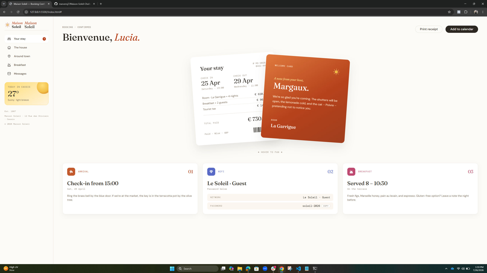

# SBA 326 — Hotel Booking Confirmation Page (Maison Soleil)
 
A responsive implementation of the [Hotel booking confirmation page](https://www.frontendmentor.io/challenges/hotel-booking-confirmation-page) design challenge from Frontend Mentor, built with semantic HTML, Bootstrap 5, and a thin layer of custom CSS.
 
**Live site:** https://marvensj7.github.io/maison-soleil/
**Repository:** (https://github.com/marvensj7/maison-soleil)
 
## Overview
 
The page is a confirmation screen for a fictional guesthouse, "Maison Soleil." The goal was to reproduce the high-fidelity design as accurately as possible, handling as much styling as I could with Bootstrap utility classes and components before writing custom CSS.
 
### Screenshot
 

 
## Built with
 
- Semantic HTML5
- Bootstrap 5.3 via CDN — grid, utilities, and components (navbar, offcanvas, nav, card, badge, buttons)
- Custom CSS — design tokens as CSS custom properties, plus the layout Bootstrap can't express
- Mobile-first workflow (375px → 1440px)
- Git / GitHub
## What I learned
 
**Retinting Bootstrap through its own variables.** Instead of writing high-specificity selectors to fight the framework, I set Bootstrap's `--bs-*` custom properties once in `:root`, so utilities inherit the palette and the base font:
 
```css
:root {
  --bs-body-bg: var(--neutral-50);
  --bs-body-font-family: 'DM Sans', sans-serif;
  --bs-body-font-size: 0.875rem; 
}
```
 
**Component variables over overrides.** Each button variant is retinted through the component's own variables (`--bs-btn-bg`, `--bs-btn-hover-bg`) rather than `.btn-primary:hover { ... !important }`.
 
**Responsive layout shift.** The sidebar is a sticky column on desktop and collapses into a Bootstrap offcanvas on mobile using the `offcanvas-lg` class — one element, two behaviors, no duplicated markup. The two overlapping "fanned" cards are absolutely positioned and tilted on desktop, then fall back to a normal stacked flow on mobile with the welcome card ordered first, matching the mobile comp.
 
## Continued development
 
Next I'd tighten pixel accuracy on the card shadows and add a `prefers-reduced-motion` guard around the hover-fan transition.
 
## Author
 
- Marvens — Per Scholas RTT-106
- Frontend Mentor — [@marvensj7](https://www.frontendmentor.io/profile/marvensj7)